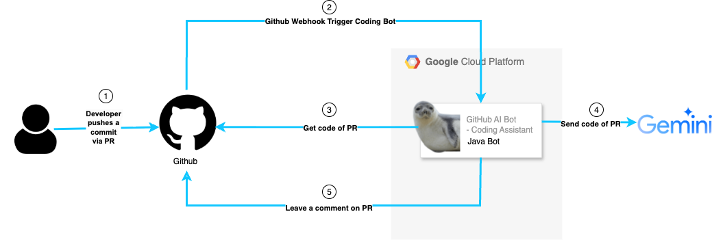

# GitHub-AI-Bot - Coding Assistant


The GitHub AI Bot – Coding Assistant is an AI-powered code review bot for all programming language projects. It automatically analyzes pull requests (PRs) and provides feedback on code quality, best practices, and possible improvements.

### How It Works

1️⃣ Developer pushes a commit via PR

2️⃣ GitHub Webhook triggers the AI Bot

3️⃣ Bot fetches the PR code

4️⃣ Bot sends the code to an AI model - uses DeepSeek API (or another LLM) for analysis.  

5️⃣ Bot comments on the PR. Provides AI-generated code reviews with suggestions and fixes. 

### Features

✅ Automated Code Review – AI detects bad practices and suggests improvements.  

✅ Code Analysis – Specialized for all programming language projects.   

✅ Customizable AI Model – Uses DeepSeek or any other AI model for analysis.

## How to Run Locally

This is a Spring Boot Application.

#### Requirements

Make sure that you have installed locally:
- Java 17+
- Maven 3.9+

#### Steps to Run the Application

1. **Build the project:**
    ```
    mvn clean install
    ```
2. **Run the application:**
    ```
    mvn spring-boot:run
    ```
3. The server should now be running on http://localhost:8080 

#### Linter

In order to run linter locally on VSC, make sure that you installed "Checkstyle for Java" extension.

## Deployment to Google Cloud Platform (GCP)

This application is deployed on **Google Cloud Platform (GCP)** using **Cloud Run**.  

**Live URL:** [GitHub AI Bot](https://github-ai-bot-658818439028.europe-west1.run.app)

#### Requirements

Make sure that you have installed locally:  
- Google Cloud SDK (`gcloud` CLI) configured with your project.

### Basic Deployment Steps  

1.  **Set up GCP**  
    * Ensure you have a Google Cloud Project.  

    * Enable the Cloud Run API, Container Registry API, and Cloud Build API.  

    * Authenticate with `gcloud auth login` and `gcloud auth configure-docker`.  

    * Set the `PROJECT_ID` environment variable: `export PROJECT_ID="your-gcp-project-id"`. Replace `"your-gcp-project-id"` with your actual project ID.  

2.  **Update `pom.xml`:**
    * Change the `<version>` tag in `pom.xml` to the desired version.

3.  **Deploy:**
    * Run `./deploy.sh` from the project's root directory.

The `deploy.sh` script will automatically:

-  Extract the version from `pom.xml`.  

-  Build and submit the Docker image to Google Cloud Build.  

-  Deploy the image to Cloud Run.

<!-- Test CD in Main -->